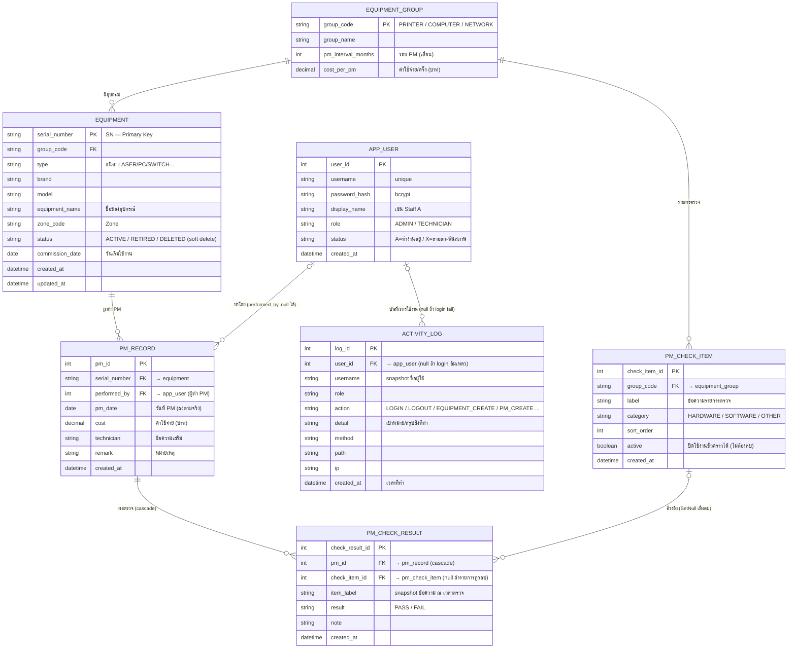

# PM_WorkShop_2025 — เอกสารออกแบบระบบ

โปรแกรมบำรุงรักษาเชิงป้องกัน (Preventive Maintenance / PM) — Web Application

---

## 1. Tech Stack ที่เลือกใช้

| ส่วน | เครื่องมือ | เหตุผล |
|------|-----------|--------|
| Frontend | **React + TypeScript + Vite** | ตรงกับความถนัด, Vite รันเร็ว เหมาะกับงานที่มีเวลาจำกัด |
| UI Library | **Ant Design (antd)** | มีตาราง/ฟอร์ม/date picker สำเร็จรูป เหมาะกับงาน CRUD + รายงาน ประหยัดเวลา |
| Backend | **Node.js + Express + TypeScript** | โครงเรียบง่าย เรียนรู้ไว เขียน REST API ได้ตรงไปตรงมา |
| ORM | **Prisma** | type-safe, รองรับ MS SQL Server, จัดการ schema/migration ให้ ทำ ER → ตารางจริงง่าย |
| Database | **MS SQL Server** | ตามที่เลือก |
| Export Excel | **ExcelJS** (ฝั่ง backend) | สร้างไฟล์ .xlsx แล้ว stream ให้ดาวน์โหลด |
| แจ้งเตือน (Alert) | คำนวณใน API `/api/alerts` (in-app) | โจทย์ต้องการแค่ "แจ้งเตือนในระบบ" ไม่ต้องส่งอีเมล |

> ทางเลือกที่ตัดออก: NestJS (โครงใหญ่/เรียนรู้นานกว่า), TypeORM (ปรับ MS SQL ยุ่งกว่า Prisma) — เก็บไว้พิจารณาภายหลังถ้าต้องการ

---

## 2. โครงสร้างโปรเจกต์

```
PM_WorkShop_2025/
├── docs/
│   └── DESIGN.md                ← เอกสารนี้
├── server/                      ← Backend (Express + Prisma)
│   ├── prisma/
│   │   └── schema.prisma        ← นิยามตาราง (มาจาก ER diagram)
│   ├── src/
│   │   ├── index.ts             ← จุดเริ่ม Express
│   │   ├── routes/
│   │   │   ├── equipment.ts     ← CRUD อุปกรณ์
│   │   │   ├── pm.ts            ← บันทึกผล PM
│   │   │   ├── alert.ts        ← คำนวณรายการถึงรอบ PM
│   │   │   └── report.ts       ← รายงาน + export Excel
│   │   └── lib/pm-logic.ts      ← สูตรคำนวณรอบ PM ครั้งถัดไป
│   └── package.json
└── web/                         ← Frontend (React + Vite)
    ├── src/
    │   ├── pages/
    │   │   ├── Dashboard.tsx    ← สรุป + การ์ดแจ้งเตือน
    │   │   ├── Equipment.tsx    ← ตาราง CRUD อุปกรณ์
    │   │   ├── PmRecord.tsx     ← ฟอร์มบันทึกผล PM
    │   │   └── Reports.tsx      ← เลือกรายงาน + ปุ่ม Export
    │   ├── api/client.ts        ← เรียก backend
    │   └── main.tsx
    └── package.json
```

---

## 3. Flow การทำงานของระบบ (อธิบาย)

ระบบมีกระบวนการหลักดังนี้:

1. **เข้าสู่ระบบ + สิทธิ์ (Login / RBAC)** — ตรวจ user/password (bcrypt) ออก JWT token; กันบัญชี `status='X'` (พ้นสภาพ); แยกสิทธิ์ 2 ระดับ
   - **ADMIN** — กำกับดูแล/ตั้งค่า/ดูรายงาน + Dashboard + จัดการรายการตรวจ PM · **ตามนโยบาย: ไม่ลงมือ PM เครื่องเอง** (ดู/ตรวจสอบประวัติ PM ได้ แต่งานบันทึก PM เป็นหน้าที่ช่าง — เป็นนโยบายการใช้งาน ระบบไม่ได้บล็อกทางเทคนิค)
   - **TECHNICIAN (ช่าง)** — **ผู้ลงมือบันทึกผล PM** + จัดการอุปกรณ์ + ดูรายงาน + Popup งานรายวัน (ไม่เห็น Dashboard)
2. **จัดการข้อมูลอุปกรณ์ (CRUD)** — เพิ่ม/แก้ไข/ลบ/ค้นหา เก็บลง `equipment` (PK = `serial_number`, แก้ SN ไม่ได้ตอน edit); **ลบ = soft delete** (`status='DELETED'` ซ่อนจากรายการ แต่เก็บประวัติ PM เดิม — เพิ่ม SN เดิมใหม่ = กู้คืนพร้อมประวัติ)
3. **บันทึกผล PM + Checklist** — เลือกอุปกรณ์ → ติ๊กรายการตรวจตามกลุ่ม (ผ่าน/ไม่ผ่าน + หมายเหตุ) → ลงวันที่จริง + ค่าใช้จ่าย → บันทึก `pm_record` + `pm_check_result` (`performed_by` = ผู้ที่ login) → คำนวณ `next_due` ใหม่ทันที
4. **แจ้งเตือน (Alert / Popup)** — คำนวณ `next_due` ของอุปกรณ์ทุกชิ้น แบ่ง 2 จุด: **Dashboard (admin)** แสดง/กรองได้ทุกสถานะ (เลยกำหนด / ใกล้ครบใน 30 วัน / ปกติ); **Popup งานประจำวันของ technician** เตือนเฉพาะ **งานของวันนั้น** = **เลยกำหนด** + **ครบกำหนดวันนี้** เท่านั้น (ไม่รวม "ใกล้จะถึง" เพื่อไม่ให้รบกวนเกินจำเป็น) — เลยกำหนด = "ล่าช้า" ทำต่อวันถัดไปได้ ไม่บังคับเสร็จในวันเดียว
5. **ประวัติ PM** — เรียงล่าสุด→เก่าสุด, คลิกแถวเปิด Popup รายละเอียด (ข้อมูลเครื่อง + ผู้ทำ + ผลตรวจ checklist รายข้อ + หมายเหตุ)
6. **จัดการรายการตรวจ PM (ADMIN เท่านั้น)** — เพิ่ม/แก้/ลบ/เปิด-ปิด `pm_check_item` แยกตามกลุ่มอุปกรณ์
7. **รายงาน + Export Excel** — แผน PM รายเดือน / ประวัติ PM รายเครื่อง / ค่าใช้จ่าย → แสดงตาราง → ดาวน์โหลด `.xlsx`
8. **บันทึกการใช้งาน (Activity Log)** — ทุก action สำคัญ (login/logout, เพิ่ม/แก้/ลบอุปกรณ์, บันทึก/ลบ PM, จัดการรายการตรวจ, ดู/Export รายงาน) ถูกบันทึกลง `activity_log` ฝั่ง server โดยอัตโนมัติ

### หลักการออกแบบหน้าจอ (UI/UX) — เน้นใช้งานง่าย สบายตา

- **ธีมสี Teal/Sage (minimal)** — กำหนดที่ `ConfigProvider` จุดเดียว (`web/src/main.tsx`): สีหลักเขียวอมฟ้านุ่ม `#2F8F83`, พื้นหลังอ่อน `#F5F8F7`, มุมมน 8, ฟอนต์ไทย Sarabun, การ์ดเงาบาง — สีสถานะ/กราฟรวมศูนย์ที่ `web/src/lib/format.ts` (`STATUS_COLORS` / `CHART_COLORS`) แก้ที่เดียวเปลี่ยนทั้งระบบ
- **หัวหน้าจอมาตรฐาน (`PageHeader`)** — ทุกหน้าใช้รูปแบบเดียวกัน: ชื่อหน้า + คำอธิบายสั้นช่วยผู้ใช้ + ปุ่มการกระทำหลัก
- **Dashboard ใช้งานเชิงรุก** — การ์ดสรุปคลิกเพื่อกรองรายการตามสถานะ (เลยกำหนด / ใกล้ครบรอบ / ปกติ) + โหลดแบบ skeleton
- **นำทางต่อได้เสมอ** — Empty state มีปุ่มพาไปทำขั้นถัดไป, ปุ่ม/ไอคอนมีคำอธิบาย, Header เบาแบบ brand
- **ไฟล์ Excel ที่ Export เข้าชุดสีเดียวกัน + อ่านง่าย** — `sendStyledExcel` (report.ts) ใช้โทน Teal/Sage: หัวรายงาน `#2F8F83` ตัวอักษรขาว, หัวคอลัมน์ `#207067`, แถว zebra `#F4F9F8`, ตรึงหัวตาราง + autoFilter; **ตัวเลข numFmt `#,##0` ชิดขวา, คอลัมน์ auto-fit ตามเนื้อหา, หัวคอลัมน์ wrap, เว้นความสูงแถว** — **คงคอลัมน์/ลำดับ/รูปแบบวันที่ D/M/YYYY เดิมตามไฟล์ตัวอย่าง** (ปรับแค่หน้าตา)
- *การเปลี่ยนแปลงนี้เป็นชั้นนำเสนอ (UI) ล้วน — โครงสร้างข้อมูล/ความสัมพันธ์ (ER) และ 7 ตารางไม่เปลี่ยน · PDF: ผู้ใช้เลือกยังไม่ทำตอนนี้*

### สูตรคำนวณรอบ PM (หัวใจของระบบ)

```
รอบ PM ตามกลุ่มอุปกรณ์:
  PRINTER  = ทุก 3 เดือน
  NETWORK  = ทุก 3 เดือน
  COMPUTER = ทุก 6 เดือน   (รวม PC และ SERVER)

วันครบรอบครั้งถัดไป (next_due):
  ฐานวันที่ = วันที่ PM ล่าสุดของอุปกรณ์นั้น
              ถ้ายังไม่เคย PM → ใช้ commission_date (วันเริ่มใช้งาน)
  next_due  = ฐานวันที่ + pm_interval_months

สถานะแจ้งเตือน:
  next_due <  วันนี้              → OVERDUE  (เลยกำหนด ‑ สีแดง)
  วันนี้ ≤ next_due ≤ วันนี้+30   → DUE_SOON (ใกล้ครบ ‑ สีเหลือง)
  next_due >  วันนี้+30           → OK       (ปกติ ‑ สีเขียว)

ค่าใช้จ่ายต่อครั้ง (เก็บที่ตาราง equipment_group):
  COMPUTER = 500   PRINTER = 300   NETWORK = 400  บาท
```

---

## 4. Flow Chart

```mermaid
flowchart TD
    Start([เริ่มโปรแกรม]) --> Login[หน้า Login]
    Login --> Auth{ตรวจ user/password bcrypt<br/>และ status ≠ X}
    Auth -- ไม่ผ่าน --> LogF[log: LOGIN_FAILED] --> Login
    Auth -- ผ่าน --> Tok[ออก JWT token<br/>log: LOGIN]
    Tok --> Role{สิทธิ์ role ?}

    Role -- ADMIN --> Dash[Dashboard: การ์ดสรุป next_due<br/>คลิกการ์ด → กรองรายการตามสถานะ]
    Role -- TECHNICIAN --> Pop[/Popup งานวันนี้<br/>เฉพาะ เลยกำหนด + ถึงกำหนดวันนี้/]
    Dash --> Menu[เมนู ตามสิทธิ์]
    Pop --> Menu

    Menu --> M1[จัดการอุปกรณ์<br/>admin + technician]
    Menu --> M2[บันทึกผล PM<br/>ช่างเป็นผู้ทำ · admin ดู/ตรวจสอบ]
    Menu --> M3[ประวัติ PM<br/>admin + technician]
    Menu --> M4[รายงาน<br/>admin + technician]
    Menu --> M5[จัดการรายการตรวจ PM<br/>ADMIN เท่านั้น]
    Menu --> Out[ออกจากระบบ]

    M1 --> CRUD{เพิ่ม / แก้ไข / ลบ}
    CRUD --> SaveEq[(equipment<br/>PK = serial_number<br/>ลบ = soft delete status=DELETED)]
    SaveEq --> Menu

    M2 --> SelEq[เลือกอุปกรณ์ที่ทำ PM]
    SelEq --> Chk[ติ๊ก Checklist ตามกลุ่มอุปกรณ์<br/>ผ่าน/ไม่ผ่าน + หมายเหตุ]
    Chk --> FillPM[ลงวันที่จริง + ค่าใช้จ่าย]
    FillPM --> SavePM[(pm_record + pm_check_result<br/>performed_by = ช่างที่ login)]
    SavePM --> Recalc[คำนวณ next_due ใหม่]
    Recalc --> Late{เลยกำหนด?}
    Late -- ใช่ --> Delay[สถานะ ล่าช้า/เลยกำหนด<br/>ทำต่อวันถัดไปได้]
    Late -- ไม่ --> Menu
    Delay --> Menu

    M3 --> Hist[ตารางประวัติ ล่าสุด→เก่า]
    Hist --> Click[คลิกแถว → Popup รายละเอียด<br/>ข้อมูลเครื่อง + ผู้ทำ + ผลตรวจ checklist]
    Click --> Menu

    M4 --> RptType{เลือกประเภทรายงาน}
    RptType --> R1[แผน PM รายเดือน]
    RptType --> R2[ประวัติ PM รายเครื่อง]
    RptType --> R3[ค่าใช้จ่าย PM รายเดือน/ปี<br/>+ Pie chart สัดส่วนตามกลุ่ม]
    R1 --> View[แสดงตาราง]
    R2 --> View
    R3 --> View
    View --> Export{Export Excel?}
    Export -- ใช่ --> Xlsx[ดาวน์โหลด .xlsx] --> Menu
    Export -- ไม่ --> Menu

    M5 --> MgChk{เพิ่ม / แก้ / ลบ / เปิด-ปิด}
    MgChk --> SaveChk[(pm_check_item)]
    SaveChk --> Menu

    Out --> LogOut[log: LOGOUT] --> Login

    SaveEq -.-> Log[(activity_log)]
    SavePM -.-> Log
    SaveChk -.-> Log
    Xlsx -.-> Log
    View -.-> Log
```



> **ทุก action สำคัญถูกบันทึกลง `activity_log` ฝั่ง server อัตโนมัติ** (login/logout, CRUD อุปกรณ์, บันทึก/ลบ PM, จัดการรายการตรวจ, ดู/Export รายงาน) — เส้นประในผังคือการเขียน log ควบคู่กับการทำงานปกติ
> Dashboard แสดงเฉพาะ **ADMIN**; **TECHNICIAN** เข้าระบบแล้วเด้ง Popup งานของวัน — เตือน **เฉพาะเครื่องที่เลยกำหนด + ครบกำหนดวันนี้** เท่านั้น (ไม่รวม "ใกล้จะถึง" เพื่อไม่รบกวนเกินจำเป็น · เลยกำหนด = "ล่าช้า" ทำต่อวันถัดไปได้ ไม่บังคับเสร็จในวันเดียว) และไม่เห็นเมนู Dashboard / จัดการรายการตรวจ PM

---

## 5. ER Diagram



### คำอธิบายความสัมพันธ์

- **EQUIPMENT_GROUP → EQUIPMENT** (1 : N) — กลุ่มอุปกรณ์ 1 กลุ่ม มีอุปกรณ์ได้หลายชิ้น และเป็นที่เก็บ "รอบ PM" + "ค่าใช้จ่าย/ครั้ง" จุดเดียว แก้ครั้งเดียวมีผลทั้งกลุ่ม
- **EQUIPMENT → PM_RECORD** (1 : N) — อุปกรณ์ 1 ชิ้น มีประวัติการ PM ได้หลายครั้ง — ใช้ **`serial_number` เป็น Primary Key** ของ equipment และเป็น FK ใน pm_record
- **`status = 'DELETED'` แทนการลบอุปกรณ์** — ผู้ใช้สั่งลบ → ตั้ง `status='DELETED'` (ซ่อนจากรายการ/Dashboard/แผน) แต่ **ไม่ลบ record** เพื่อให้ `pm_record` (FK `serial_number`) ยังอยู่ครบ — ประวัติ PM เดิมดูได้ตลอด; เพิ่ม SN เดิมใหม่ = กู้คืน (revive) พร้อมประวัติ (soft-delete หลักเดียวกับ `app_user.status` X — รักษา referential integrity)
- **APP_USER → PM_RECORD** (1 : N) — ผู้ใช้ 1 คนทำ PM ได้หลายครั้ง; `performed_by` บันทึก "ใครเป็นคนทำ PM" (เช่น Staff A) อัตโนมัติจากผู้ที่ login
- **APP_USER** เก็บบัญชีผู้ใช้ + สิทธิ์ (`role`): **ADMIN** กำกับดูแล/ตั้งค่า/ดูรายงาน + Dashboard — *ตามนโยบายไม่ลงมือ PM เอง* · **TECHNICIAN (ช่าง)** เป็นผู้บันทึก PM + ดูประวัติ/รายงาน + Popup งานรายวัน (ไม่เห็น Dashboard) — รหัสผ่านเก็บแบบ hash (bcrypt) ไม่เก็บ plaintext
- **`status` (A/X) แทนการลบ user** — พนักงานลาออก/พ้นสภาพ ตั้ง `status = 'X'` (ห้าม login) แต่ **ไม่ลบ record** เพื่อให้ `pm_record.performed_by` ยังโยงชื่อผู้ทำ PM ในประวัติได้ตลอด (soft-delete — รักษา referential integrity)
- **APP_USER → ACTIVITY_LOG** (1 : N) — audit log บันทึกทุก action สำคัญ (login/logout, เพิ่ม/แก้/ลบอุปกรณ์, บันทึก/ลบ PM, ดู/Export รายงาน) ว่าใครทำ เมื่อไร จาก IP ไหน — เก็บ server-side ปลอมไม่ได้ (`user_id` เป็น null ได้กรณี login ล้มเหลว)
- **EQUIPMENT_GROUP → PM_CHECK_ITEM** (1 : N) — รายการตรวจเช็ค (checklist) แยกตามกลุ่มอุปกรณ์ แบ่งหมวด Hardware/Software; **ADMIN เพิ่ม/แก้/ลบ/ปิดใช้งานเองได้** (`active` = soft toggle)
- **PM_RECORD → PM_CHECK_RESULT ← PM_CHECK_ITEM** — ตอนบันทึก PM ช่างติ๊กผลแต่ละข้อ (PASS/FAIL + หมายเหตุ) เก็บลง `pm_check_result` พร้อม **snapshot `item_label`** เพื่อให้ประวัติอ่านได้แม้รายการตรวจถูกแก้/ลบภายหลัง (FK `check_item_id` = SetNull, ผูก `pm_id` แบบ Cascade)
- **แผน PM (Plan) ไม่ต้องมีตารางแยก** — คำนวณสด ๆ จาก `pm_record` ล่าสุด + `pm_interval_months` ลดความซับซ้อน เหมาะกับเวลา 5 วัน
- เก็บ `cost` ซ้ำใน `pm_record` (snapshot) เพื่อให้รายงานย้อนหลังถูกต้องแม้ภายหลังมีการปรับราคาในตาราง group

---

## 6. ขั้นตอนถัดไป (แผนทำงาน 5 วัน)

| วัน | งาน |
|-----|-----|
| 1 | ตั้งโปรเจกต์ (server + web), เชื่อม MS SQL, เขียน `schema.prisma` ตาม ER, seed ข้อมูลตัวอย่างจากโจทย์ |
| 2 | API + หน้า CRUD อุปกรณ์ ให้ครบ เพิ่ม/แก้ไข/ลบ/ค้นหา |
| 3 | บันทึกผล PM + สูตรคำนวณ `next_due` + Dashboard แจ้งเตือน |
| 4 | รายงาน 3 แบบ + ปุ่ม Export Excel (ExcelJS) |
| 5 | ทดสอบ, เก็บงานหน้าจอ, เตรียมสไลด์/เดโม่นำเสนอ |
